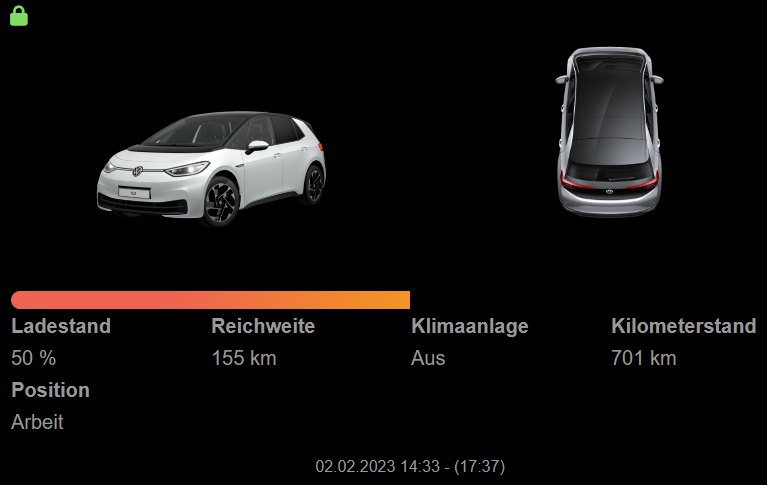
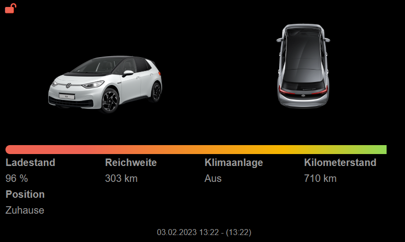
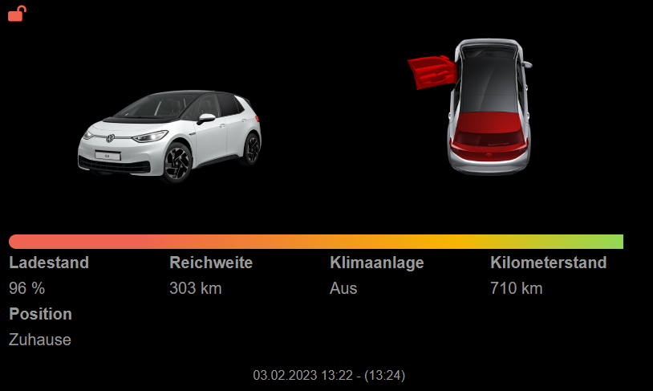
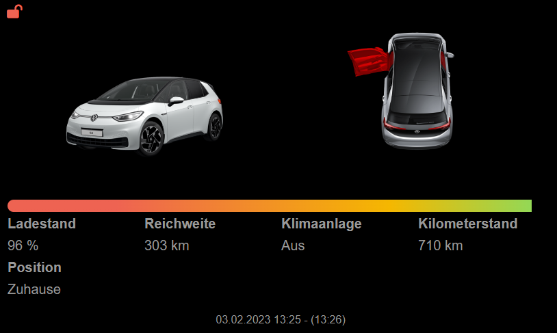
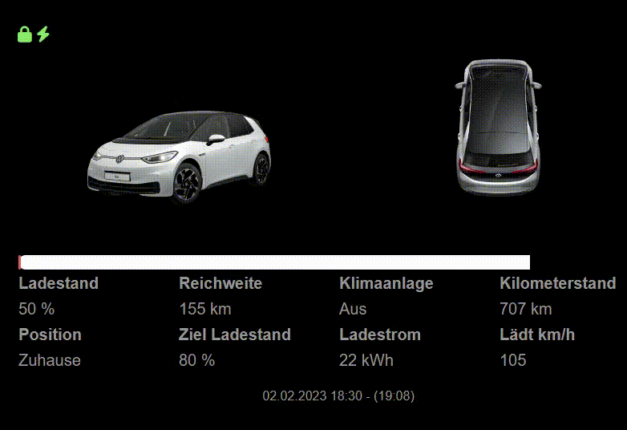

[](https://pypi.org/project/weconnect/)
[](https://github.com/NikolasRupp/MMM-weconnectid/blob/master/LICENSE)

# MMM-weconnectid

A module to integrale informations from  [We Connect ID](https://www.volkswagen.de/de/besitzer-und-nutzer/myvolkswagen.html) into the [MagicMirror](https://github.com/MichMich/MagicMirror).

## I'am a beginner at Programming so I think there are a lot of better ways to implement it. Feel free to send an merge request.

## Usage

### Installation

- You have to register your VW ID at [MyVolkswagen](https://www.volkswagen.de/de/besitzer-und-nutzer/myvolkswagen.html) and have a valid WE Connect ID subscription

- You need Python 3.9 or higher to connect to the Api. You can have a look [here](https://raspberrytips.com/install-latest-python-raspberry-pi/) on how to install it.

- If not done you have to install some Packages via Pip.

```
pip install Pillow
pip install weconnect[Images]
```

If Python 3.9 is not your default Python Version your command should look something like this.

```
python3.9 -m pip install Pillow
python3.9 -m pip install weconnect[Images]
```
Have a look at the config Table to see how you set the Python version in the module.

- To use this module, clone this repository to your __modules__ folder of your MagicMirror:

`cd ~/MagicMirror/modules`

`git clone https://github.com/NikolasRupp/MMM-weconnectid.git`

- Now just add the module to your config.js file ([config entries](#configuration)).

### Configuration

The module needs the default configuration block in your config.js to work.

```javascript
{
  module: 'MMM-weconnectid',
  position: "top_left",
  config: {
    username: "",
    password: "",
    vin: "",
    python: "python3",
    maxHeight: "300px",
    maxWidth: "800px",
    remainingSOCyellow: 70,
    remainingSOCred: 20,
    barstyle: "fluent",
    updateFrequency: 600000,
    timestamp: true,
    googleAPI: "",
    positions: [],
  }
},
```
The following properties can be configured:

|Option|Description|Options|Default|Required|Type|
|---|---|---|---|---|---|
|username|Your Login Username|-|-|yes|Text|
|password|Your Login Password|-|-|yes|Text|
|vin|The VIN of your Vehicle|-|-|yes|Text|
|python|Python u want to use|Any Python higher than 3.9|"python3"|no|Text|
|maxHeight|Max Height of the Pictures|Any px or % value|"300px"|no|Text|
|maxWidth|Max Width of the Pictures|Any px or % value|"800px"|no|Text|
|remainingSOCyellow|Percentage when the Progress Bar of the Battery should be yellow|0-100|70|no|Number|
|remainingSOCred|Percentage when the Progress Bar of the Battery should be red|0-100|20|no|Number|
|barstyle|Style of the Progress Bar|"fluent", "strict"|"fluent"|no|Text|
|updateFrequency|Update Frequency|Any Value|600000|no|Number|
|timestamp|If the Timestamp should be shown|true, false|true|no|Boolean|
|googleAPI|Googel Maps API Key if you want to convert the Position of the Vehicle to an Adress [More Information](#google-api)|-|-|no|Text|
|positions|Custum Names for the Parking Position of the Car [More Information](#positions)|-|-|no|List|

#### Google Api

You can get your Google API Key [here](https://developers.google.com/maps/documentation/javascript/get-api-key?hl=de)
If you have logged in you can create an Project and call it whatever you like. In that Project you have to activate the Geocoding API and copy the API Key in the config file.

There is a Price for the API but you get 200$ every moth for free what are about 40.000 API requests, which are about 1 every Minute, which should be enough. You can read more about it [here](https://mapsplatform.google.com/intl/de/pricing/).

If you don't enter an API key the Location, if not defined in [Positions](#positions) will be shown as __unkown__.

#### Positions
You can define Positions where your car is parked often. You can Enter as many locations as you want. To get the Latitude and Longitude you can use any website like [gps-coordinates.net](https://www.gps-coordinates.net/).

Each Position has to have the following Parameter

|Paramter|Description|Type|
|---|---|---|
|Name|Name of the description that should be shown|Text|
|Latitude|Latitude of the Postion|Number|
|Longitude|Longitude of the Position|Number|
|Radius|Radius around the Coordinates|Number|


An Example would be
```
[["Home",38.8796005249,-76.983428955,50],["Work",52.51385794,13.35827382,300]]
```

## Credits
This module uses [tillsteinbach/WeConnect-python](https://github.com/tillsteinbach/WeConnect-python) to connect to the API. Many thanks for that

## Tested with
- Volkswagen ID.3 Modelyear 2023

## Pictures
Fluent Progress Bar


Strict Progress Bar


Normal View


Unlocked Car


Open Door and Trunk


Open Door and Front Right Window


Charging View

